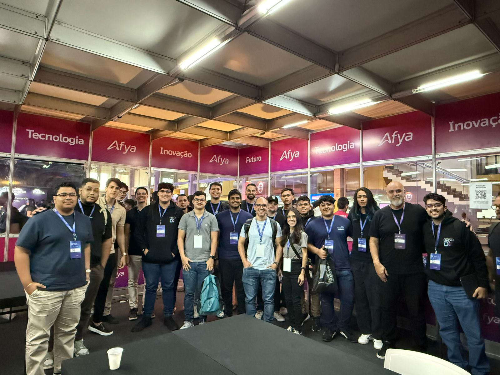

# 🕵️ Cabueta - Jogo de Detecção de Bot

Um jogo onde você precisa descobrir qual dos participantes é o "Cabueta" (chatbot disfarçado) em uma sala de chat com 3 pessoas.



## 🎪 Desenvolvido no AWS Vibe Coding Dojo - ROGADX 2025

Este projeto foi criado durante o **AWS Vibe Coding Dojo** no evento **ROGADX 2025**. Uma aplicação divertida que combina inteligência artificial com um jogo simples de detecção de bots.

## 🎮 Como Funciona

- **3 Participantes**: Você + 1 humano + 1 Cabueta (bot da AWS Bedrock)
- **Tempo Limite**: 1 minuto de conversa
- **Objetivo**: Descobrir quem é o bot disfarçado
- **Mecânica**: Chat em tempo real com turnos livres

## 🚀 Instalação e Execução

### Pré-requisitos

1. **Node.js** (versão 16 ou superior)
2. **Credenciais AWS** configuradas com acesso ao Bedrock
3. **Região AWS** com Claude 3 Haiku disponível

### Configuração AWS

```bash
# Configure suas credenciais AWS
aws configure

# Ou defina as variáveis de ambiente
export AWS_ACCESS_KEY_ID=sua_access_key
export AWS_SECRET_ACCESS_KEY=sua_secret_key
export AWS_REGION=us-east-1
```

### Instalação

```bash
# Instalar dependências
npm install

# Executar o servidor
npm start
```

### Acesso

Abra seu navegador em: `http://localhost:3000`

## 🛠️ Tecnologias Utilizadas

- **Backend**: Node.js + Express + Socket.io
- **Frontend**: HTML5 + CSS3 + JavaScript
- **IA**: Amazon Bedrock (Claude 3 Haiku)
- **Real-time**: WebSockets

## 🎯 Funcionalidades

- ✅ Chat em tempo real
- ✅ Timer de 1 minuto
- ✅ Bot inteligente via Bedrock
- ✅ Interface responsiva
- ✅ Sistema de pontuação
- ✅ Reconexão automática

## 🔧 Configurações

### Modelo de IA
Por padrão usa `anthropic.claude-3-haiku-20240307-v1:0`. Para alterar, edite o `modelId` no `server.js`.

### Região AWS
Defina a região via variável de ambiente:
```bash
export AWS_REGION=us-west-2
```

### Porta do Servidor
```bash
export PORT=8080
```

## 🐛 Troubleshooting

### Erro de Credenciais AWS
- Verifique se suas credenciais estão configuradas
- Confirme se tem permissão para usar o Bedrock
- Teste com: `aws bedrock-runtime list-foundation-models`

### Erro de Região
- Certifique-se que a região suporta Claude 3 Haiku
- Regiões recomendadas: `us-east-1`, `us-west-2`

### Problemas de Conexão
- Verifique se a porta 3000 está livre
- Teste a conectividade WebSocket

## 📝 Desenvolvimento

### Estrutura do Projeto
```
cabueta/
├── server.js          # Servidor principal
├── package.json       # Dependências
├── public/
│   ├── index.html     # Interface do jogo
│   └── game.js        # Lógica do cliente
├── images/
│   └── team.jpeg      # Foto do time
└── README.md          # Este arquivo
```

### Logs
O servidor exibe logs úteis no console para debugging.

## 🏆 Equipe AWS Vibe Coding Dojo

Desenvolvido com muito ☕ e 🧠 durante o AWS Vibe Coding Dojo no ROGADX 2025.

---

**Divirta-se descobrindo o Cabueta! 🤖🕵️**

*Projeto criado durante o AWS Vibe Coding Dojo - ROGADX 2025*
